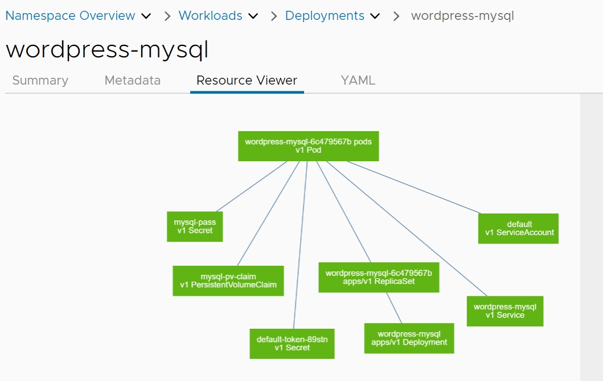
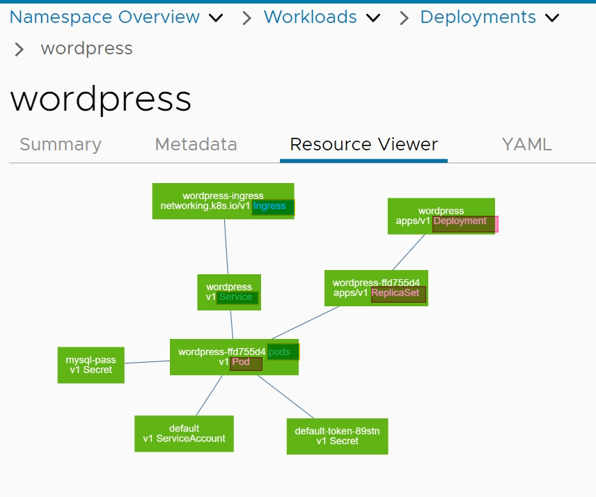
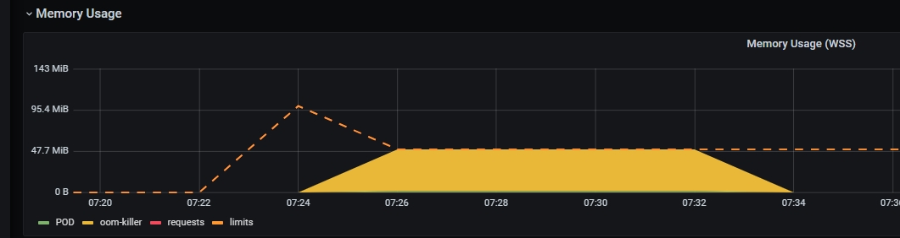

## Ingress、Service、Deployment、ReplicaSet、Pod

+ Pod: 一組（一個或多個）container； 這些容器共享存儲、網絡、以及怎樣運行這些容器的聲明； 是K8S 最小的運作單位

+ ReplicaSet: 一個用來識別可獲得的Pod 的集合的選擇算符、一個用來標明應該維護的副本個數的數值、一個用來指定應該創建新Pod 以滿足**副本**個數條件時要使用的Pod 模板等, 可以透過它來 **rollout / rollback**

+ Deployment: 定義Deployment 以創建新的ReplicaSet，或刪除現有Deployment， 並通過新的Deployment 收養其資源ex: pods

+ Service: Kubernetes 為 Pod 提供了自己的 IP 地址和一組 Pod 的單個 DNS 名稱，並且可以在它們之間進行負載平衡作為網絡服務

+ Ingress: HTTP 和 HTTPS 路由暴露給集群 內的Service。流量路由 由 Ingress 資源上定義的規則控制。

網路流量:

    ingress --> Service --> Pods

Pods 建立:

    Deployment --> ReplicaSet --> Pods

## Architecture wordpress





### 將 kubeconfig 放在對的位置

+ [kubeconfig](./user-config) 選自己的, 別拿別人的喔!!

```
# https://kubernetes.io/docs/tasks/tools/
curl -LO "https://dl.k8s.io/release/$(curl -L -s https://dl.k8s.io/release/stable.txt)/bin/linux/amd64/kubectl"

mv kubeconfig ~/.kube/config
```

### install wordpress

#### yaml install

```bash
## 修改網址
sed -i 's/harry.10.136.152.227.nip.io/xxx.10.136.152.227.nip.io/g' yaml/7_wordpress-ingress.yaml
## 安裝
kubectl --namespace wordpress apply -f yaml/
## 查看  
kubectl get all,pvc,ingress -n wordpress

## 在瀏覽器上
http://xxx.10.136.152.227.nip.io

## 清除
kubectl --namespace wordpress delete -f yaml/
```

#### helm install

```bash
## 下載helm 工具
curl -sSL https://raw.githubusercontent.com/helm/helm/master/scripts/get-helm-3 | bash

## 佈署 namespace 
kubectl apply -f yaml/1_namespace.yaml

## 使用helm 安裝
helm --namespace wordpress install wordpress helm/. \
  --set mariadb.primary.persistence.enabled=true \
  --set mariadb.primary.persistence.size=20Gi \
  --set persistence.enabled=false \
  --set service.type=ClusterIP \
  --set ingress.enabled=true \
  --set ingress.hostname=xxx.10.136.152.227.nip.io


# 查看
helm list -n wordpress
kubectl get all,pvc,ingress -n wordpress

## 在瀏覽器上
http://xxx.10.136.152.227.nip.io

##清理
# helm delete wordpress -n wordpress
```

### install UI Tools

```
## install octant 
helm install octant octant/ --set "ingress.hosts[0].host=octant-harry.10.136.152.227.nip.io,ingress.hosts[0].paths[0].path=/"
```

### in browser

+ octant-harry.10.136.152.227.nip.io

+ xxx.10.136.152.227.nip.io

+ [Kubernetes Deployment Builder](https://harryliu123.github.io/deployment/)

### 試看看透過 Kubernetes Deployment Builder 建立一個nginx 服務

```
cat <<EOF | kubectl --kubeconfig kubeconfig.yaml apply -f -

apiVersion: v1
kind: Namespace
metadata:
  name: nginx

---
apiVersion: apps/v1
kind: Deployment
metadata:
  namespace: nginx
  name: nginx-deploy
spec:
  replicas: 1
  selector:
    matchLabels:
      app: nginx
  template:
    metadata:
      labels:
        app: nginx
    spec:
      containers:
        - name: nginx
          image: e4e-harbor.deltaww.com/docker-hub/library/nginx:latest
          resources:
            limits:
              memory: 50Mi
              cpu: 10m
            requests:
              memory: 50Mi
              cpu: 10m
          ports:
            - containerPort: 80

---
apiVersion: v1
kind: Service
metadata:
  name: nginx-deploy-service
  namespace: nginx
  labels:
    name: nginx-deploy-service
spec:
  ports:
    - port: 80
      targetPort: 80
      protocol: TCP
  selector:
    app: nginx
  type: ClusterIP

EOF
```

透過 port-forward 看到服務

```
 kubectl port-forward svc/nginx-deploy-service 80:80  -n aaaa

 ## in browser
 http://127.0.0.1
```

### scale nginx

+ scale pod 數量變成4

```
kubectl get po -n nginx
kubectl scale --replicas=4 deployment nginx-deploy -n nginx
kubectl get po -n nginx
```

## OOM

+ 體驗一下 OOM , pod 會被k8s 給停止

+ 設定 limits 來限制pod的資源, 並透過 replics 來增加pod數量達到擴增能量

```
kubectl run oom-killer --image=harryliu123/oom-killer:latest --limits memory=50Mi --restart=Never 
```

